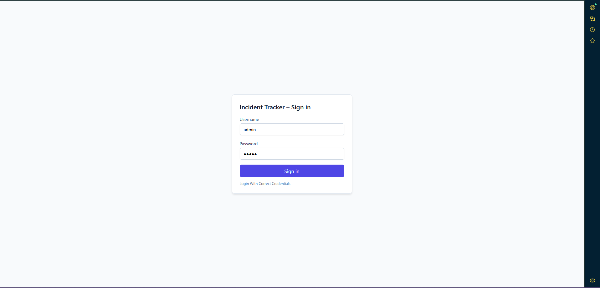
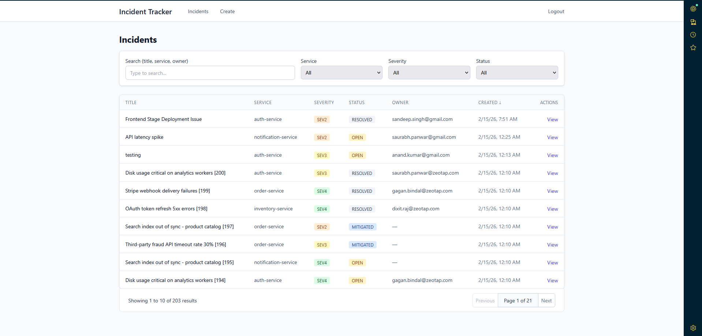
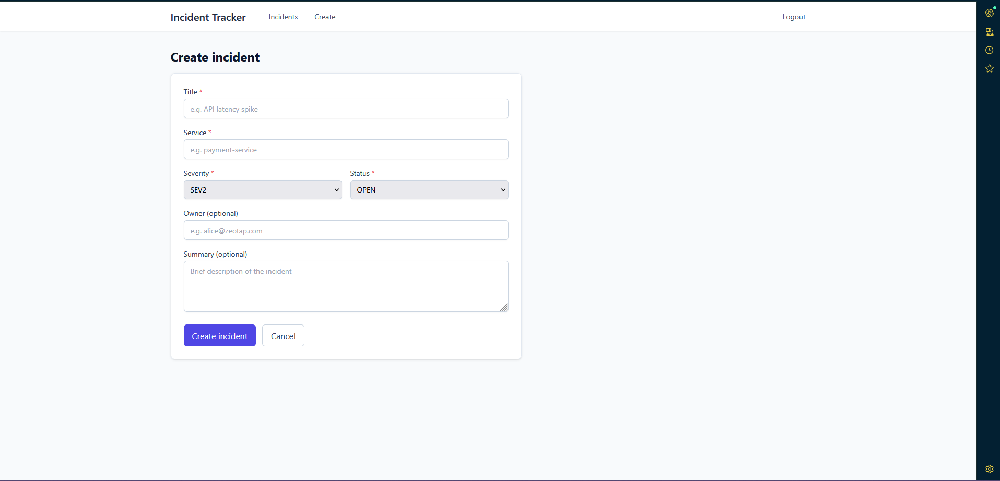
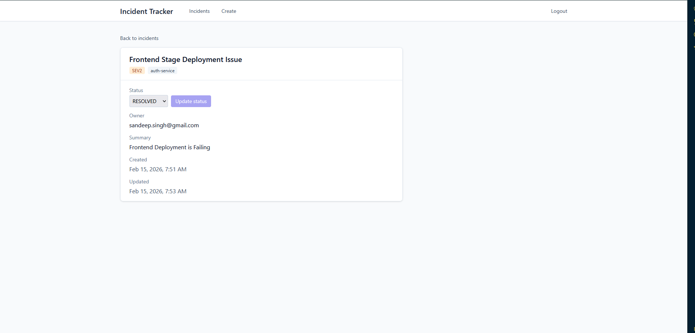
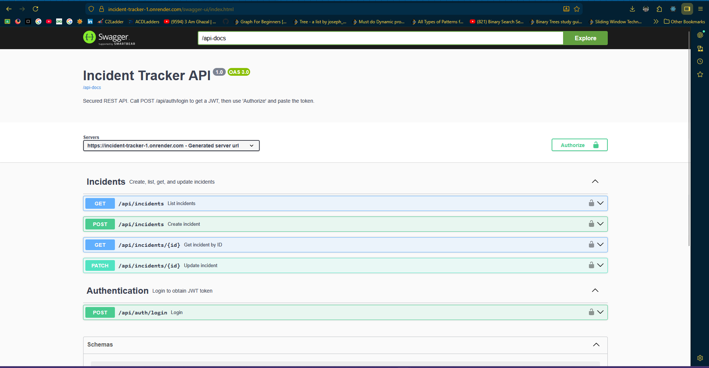
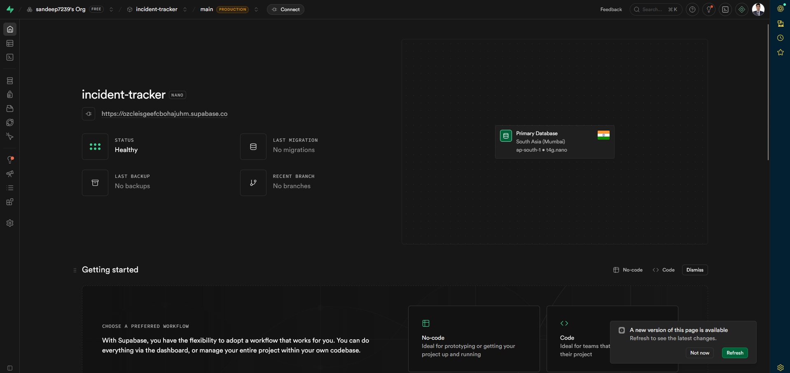
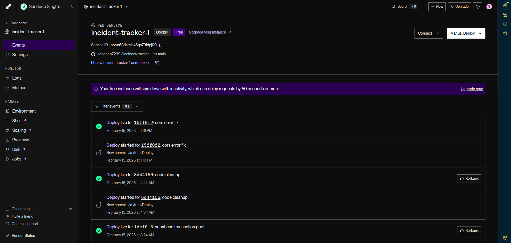
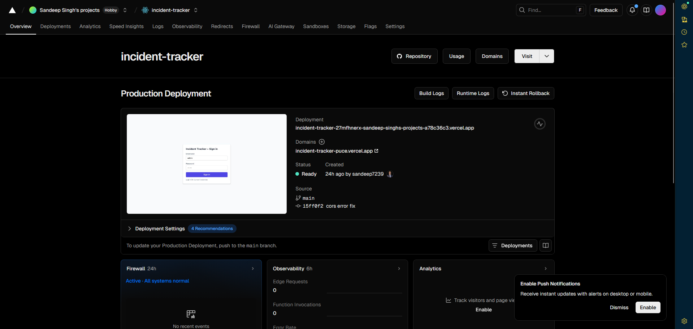

# Incident Tracker – Full Stack Project (Live Deployed)

A production-style full-stack Incident Tracker built with React and Spring Boot. The application is fully deployed with a cloud database, hosted backend APIs, and a live frontend UI.

---

## Live Demo

* **Frontend (Vercel):** [https://incident-tracker-puce.vercel.app/](https://incident-tracker-puce.vercel.app/)
* **Backend API (Render):** [https://incident-tracker-1.onrender.com](https://incident-tracker-1.onrender.com)
* **Swagger Docs:** [https://incident-tracker-1.onrender.com/swagger-ui/index.html](https://incident-tracker-1.onrender.com/swagger-ui/index.html)
* **Database (Supabase PostgreSQL):** Hosted on Supabase Cloud

---

## Overview

Incident Tracker allows teams to log, manage, and track operational incidents. It demonstrates real-world full-stack architecture including cloud deployment, stateless authentication, and scalable API design.

Key highlights:

* Fully deployed full-stack app
* JWT authentication
* Cloud PostgreSQL database
* Swagger API documentation
* Server-side filtering & pagination

---

## Tech Stack

### Frontend (Vercel Hosted)

| Layer   | Technology                  |
| ------- | --------------------------- |
| UI      | React 19                    |
| Routing | React Router 6              |
| Styling | Tailwind CSS 3              |
| HTTP    | Axios                       |
| Testing | Jest, React Testing Library |
| Hosting | Vercel                      |

### Backend (Render Hosted)

| Layer     | Technology                  |
| --------- | --------------------------- |
| Runtime   | Java 21                     |
| Framework | Spring Boot 3.2             |
| Security  | Spring Security + JWT       |
| ORM       | Spring Data JPA, Hibernate  |
| API Docs  | SpringDoc OpenAPI (Swagger) |
| Build     | Gradle 8                    |
| Hosting   | Render                      |

### Database (Supabase)

| Service | Technology                    |
| ------- | ----------------------------- |
| DB      | PostgreSQL (Supabase Managed) |
| Region  | AWS ap-south-1                |
| SSL     | Enabled                       |

---

## Architecture

```
Vercel (React Frontend)
          ↓
Render (Spring Boot REST API)
          ↓
Supabase (Managed PostgreSQL)
```

* Frontend communicates with backend via REST APIs
* Backend validates JWT using Spring Security filters
* Supabase provides a managed PostgreSQL instance

---

## Features

### Authentication

* Username/password login
* JWT-based stateless authentication
* Protected frontend routes
* Auto logout on token expiry (401 handling)

### Incident Management

* Create incidents
* Paginated incident list
* Server-side filtering & sorting
* Search by title/service/owner
* Incident detail page
* Status lifecycle (OPEN → MITIGATED → RESOLVED)

### Developer Experience

* Swagger UI for API testing
* Cloud deployment ready
* Database seeding with sample data
* Clean layered backend architecture

---

## Deployment Details

### Frontend – Vercel

* Hosted using Vercel static deployment
* Auto builds from GitHub
* Environment variable used:

```
REACT_APP_API_URL=https://incident-tracker-1.onrender.com/api
```

Live URL:
[https://incident-tracker-puce.vercel.app/](https://incident-tracker-puce.vercel.app/)

---

### Backend – Render

* Spring Boot deployed as a web service
* Auto deploy from GitHub
* Java 21 runtime
* Gradle build pipeline

Base URL:
[https://incident-tracker-1.onrender.com](https://incident-tracker-1.onrender.com)

Swagger:
[https://incident-tracker-1.onrender.com/swagger-ui/index.html](https://incident-tracker-1.onrender.com/swagger-ui/index.html)

---

### Database – Supabase PostgreSQL

Cloud PostgreSQL hosted on Supabase.

JDBC URL used:

```
jdbc:postgresql://aws-1-ap-south-1.pooler.supabase.com:6543/postgres?sslmode=require&prepareThreshold=0
```

Features:

* Managed PostgreSQL
* SSL enforced
* No local DB setup required

---

## API Overview

| Method | Endpoint              | Description       | Auth   |
| ------ | --------------------- | ----------------- | ------ |
| POST   | `/api/auth/login`     | Login and get JWT | No     |
| POST   | `/api/incidents`      | Create incident   | Bearer |
| GET    | `/api/incidents`      | List incidents    | Bearer |
| GET    | `/api/incidents/{id}` | Get incident      | Bearer |
| PATCH  | `/api/incidents/{id}` | Update incident   | Bearer |

Base API URL:
[https://incident-tracker-1.onrender.com/api](https://incident-tracker-1.onrender.com/api)

---

## Demo Credentials

```
Username: admin
Password: admin
```

Also available:

```
user / user
```

---

## Security Model

* JWT issued on login
* Stored in localStorage (frontend)
* Axios interceptor injects Bearer token
* Spring Security filter validates token
* Stateless authentication (no sessions)

---

## Testing

### Backend

* Unit tests (Service layer, JWT utils)
* Integration tests (Controllers)
* Repository tests using H2

### Frontend

* Auth guard tests
* Routing tests
* Login flow validation
* Layout rendering tests

---

## Project Structure

```
incident-tracker/
├── frontend/   # React app (Vercel)
├── backend/    # Spring Boot API (Render)
└── README.md
```

---

## Screenshots

* Login screen

* Incident list

* Create incident form

* Incident detail page

* Swagger UI

* Supbase Database Deployed UI

* Render Deployed UI

* Vercel Deployed UI


---

## Configuration

### Frontend Environment Variable

```
REACT_APP_API_URL=https://incident-tracker-1.onrender.com/api
```

### Backend Environment Variables (Recommended)

* `JWT_SECRET`
* `SPRING_DATASOURCE_URL`
* `SPRING_DATASOURCE_USERNAME`
* `SPRING_DATASOURCE_PASSWORD`

---

## Design Decisions

* **JWT over sessions:** Stateless and scalable
* **Supabase DB:** Zero-maintenance managed PostgreSQL
* **Render hosting:** Simple Java deployment
* **Vercel frontend:** Fast global CDN delivery
* **Server-side pagination:** Scales to large datasets
* **Swagger integration:** Easy API testing for reviewers

---

## License

Built as part of a full-stack assignment/demo project. Free to reuse and extend.
